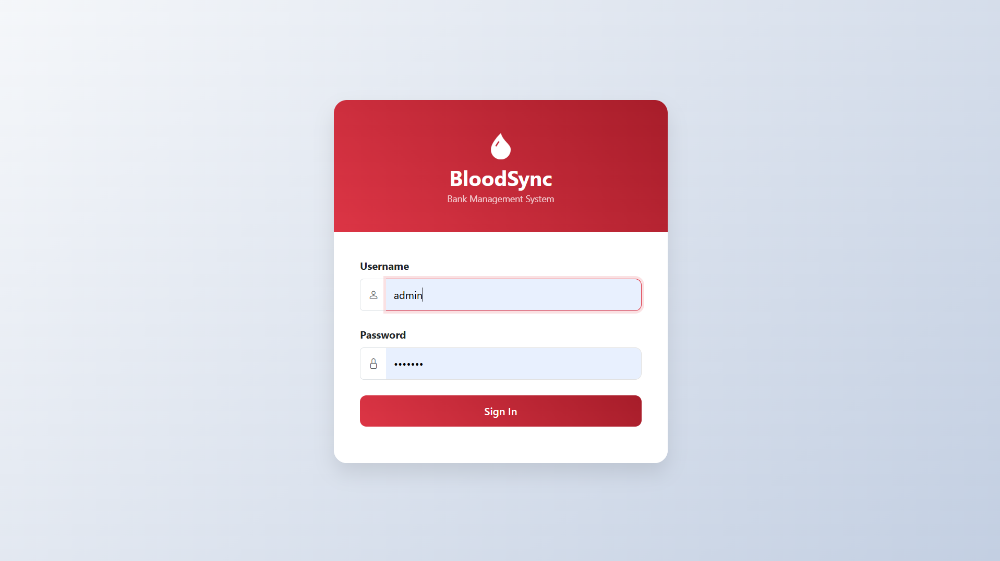
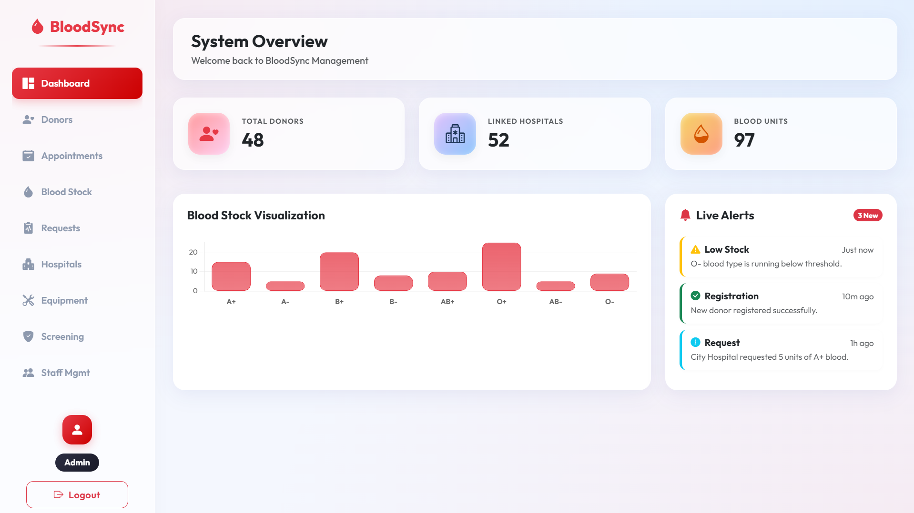
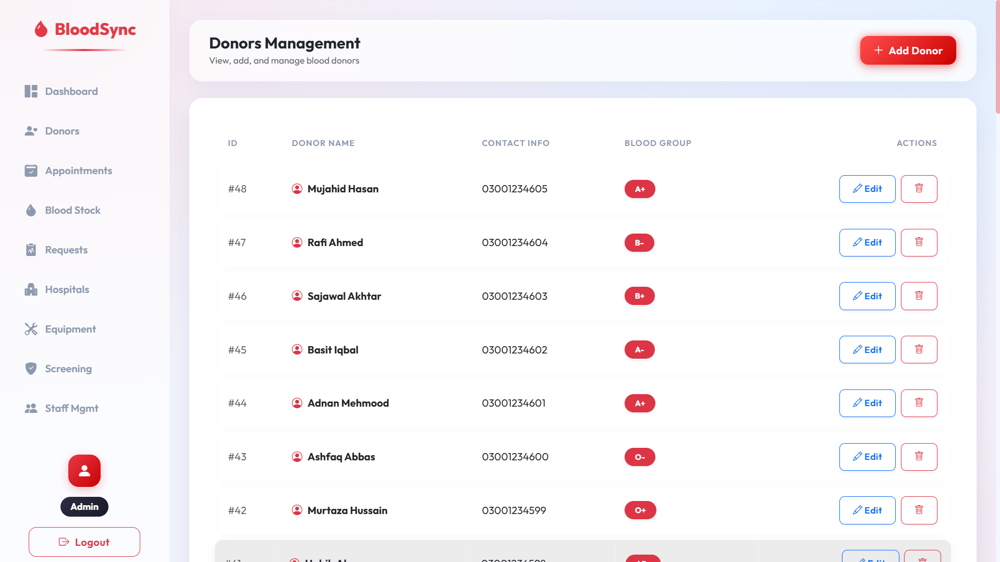
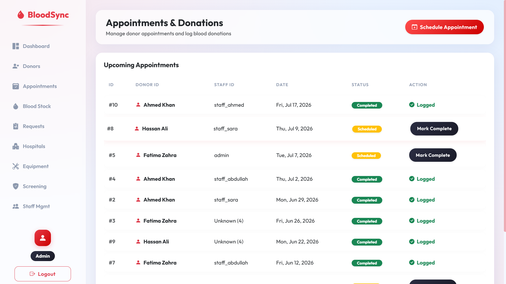

# 🩸 BloodSync — Blood Bank Management System


> A full-stack Blood Bank Management System built with HTML, CSS, JavaScript, Node.js and PostgreSQL. Features a complete dashboard, donor management, appointment booking, blood stock tracking, and role-based access for admins and users.

---

## 📸 Screenshots

### 🔐 Login Page


### 📊 Dashboard


### 🧑‍🤝‍🧑 Donors Management


### 📅 Appointments & Donations


---

## ✨ Features

- 🔐 **Role-based access** — separate Admin and User login
- 🧑‍🤝‍🧑 **Donor Management** — add, view, and manage blood donors
- 📅 **Appointment Booking** — schedule and track donation appointments
- 🩸 **Blood Stock Tracking** — monitor blood inventory by type
- 🏥 **Hospital Management** — manage connected hospitals
- 🧪 **Screening Records** — track donor health screening
- 👨‍⚕️ **Staff Management** — manage blood bank staff
- 🛠️ **Equipment Tracking** — monitor medical equipment
- 📋 **Blood Requests** — handle incoming blood requests

---

## 🛠️ Tech Stack

| Layer | Technology |
|-------|-----------|
| Frontend | HTML5, CSS3, JavaScript |
| Backend | Node.js, Express.js |
| Database | PostgreSQL |
| Auth | Middleware-based role access |

---

## 📁 Project Structure

```
BloodSync/
├── index.html          # Main dashboard
├── login.html          # Login page
├── donors.html         # Donor management
├── appointments.html   # Appointment booking
├── blood-stock.html    # Blood inventory
├── blood-requests.html # Blood requests
├── hospitals.html      # Hospital management
├── staff.html          # Staff management
├── equipment.html      # Equipment tracking
├── screening.html      # Screening records
├── sidebar.html        # Shared sidebar
├── css/                # Stylesheets
├── js/                 # JavaScript files
├── routes/             # Express routes
├── middleware/         # Auth middleware
├── images/             # Project screenshots
├── server.js           # Entry point
├── db.js               # Database connection
└── init_db.js          # Database initializer
```

---

## 🚀 Getting Started

### Prerequisites
- Node.js installed
- PostgreSQL installed and running

### Installation

1. **Clone the repository**
```bash
git clone https://github.com/khizran-zubair3/BloodSync.git
cd BloodSync
```

2. **Install dependencies**
```bash
npm install
```

3. **Setup environment variables**

Create a `.env` file in the root folder:
```env
DB_HOST=localhost
DB_PORT=5432
DB_NAME=bloodsync
DB_USER=your_postgres_username
DB_PASSWORD=your_postgres_password
```

4. **Initialize the database**
```bash
node init_db.js
```

5. **Run the server**
```bash
node server.js
```

6. **Open in browser**
```
http://localhost:3000
```

---

## 👨‍💻 Developer

**Khizran Zubair**
BSc Software Engineering — SZABIST University, Karachi
📧 khizranzubair3@gmail.com
🔗 [LinkedIn](https://www.linkedin.com/in/khizran-zubair-094a5624a)
🐙 [GitHub](https://github.com/khizran-zubair3)

---

## 📄 License

This project is open source and available under the [MIT License](LICENSE).
